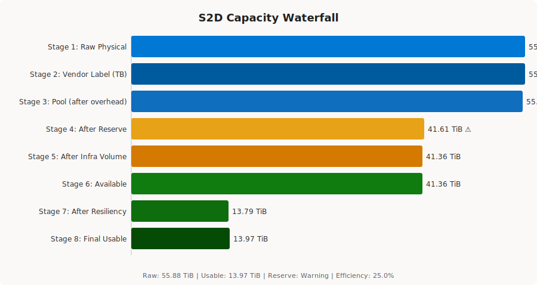

<p align="center">
  
</p>

[](https://azurelocal.cloud)
[](https://www.powershellgallery.com/packages/S2DCartographer)
[](LICENSE)
[](https://github.com/PowerShell/PowerShell)
[](https://github.com/AzureLocal/azurelocal-s2d-cartographer/actions/workflows/ci.yml)

Documentation: [azurelocal.cloud](https://azurelocal.cloud) | Solutions: [Azure Local Solutions](https://azurelocal.cloud)

> *Map your storage. Know your capacity.*

S2DCartographer connects to a live Azure Local or Windows Server cluster, inventories every layer of the Storage Spaces Direct stack, and produces publication-quality capacity analysis, health assessments, and visual diagrams. It answers the questions every S2D administrator actually has: *How much usable space do I really have? Is my reserve adequate? Am I overcommitted?*

> **Planning a new cluster?** Use [Azure Local Surveyor](https://azurelocal.github.io/azurelocal-surveyor) to model capacity, compute, and workloads *before* you deploy. Then run S2DCartographer on the running cluster to validate what was actually built. Surveyor plans; Cartographer verifies.

---

## The Problem

Storage Spaces Direct is one of the most misunderstood technologies in the Azure Local ecosystem:

- **TiB vs TB** — Drive labels lie. A "1.92 TB" NVMe shows as ~1.75 TiB in Windows. S2DCartographer displays *both units everywhere*.
- **Reserve space** — Most deployments skip it. S2DCartographer measures what you have against what you need.
- **Resiliency overhead** — Three-way mirror uses 33% of raw capacity. S2DCartographer shows the full waterfall.
- **Infrastructure volume blindspot** — Azure Local creates a hidden infrastructure volume. S2DCartographer finds it.
- **No expected vs actual comparison** — Every existing calculator is a planning tool. S2DCartographer scans your live cluster.

---

## What It Does

| Capability | Description |
| --- | --- |
| **Physical Disk Inventory** | All disks per node: media type, size, firmware, wear, role (cache vs capacity) |
| **Storage Pool Analysis** | Pool health, allocation, reserve adequacy, thin overcommit detection |
| **Volume Map** | All volumes with resiliency type, footprint, provisioning type, efficiency |
| **Cache Tier Analysis** | Cache configuration, binding ratio, all-flash software cache detection |
| **Health Checks** | 10 pass/fail checks with severity and remediation guidance |
| **Capacity Waterfall** | 8-stage pipeline from raw physical to final usable VM capacity |
| **Reports** | HTML, Word, PDF, and Excel — ready for customer deliverables |
| **Diagrams** | SVG waterfall, disk-node map, pool layout, resiliency, health card |
| **TiB/TB everywhere** | Dual-unit display on every capacity value in every output |

---

## Sample Output



---

## Installation

```powershell
Install-Module S2DCartographer -Scope CurrentUser
```

**Requirements:** PowerShell 7.2+, Windows (RSAT not required on cluster nodes).

---

## Quick Start

```powershell
# One command — connect, collect, report, disconnect
Invoke-S2DCartographer -ClusterName "c01-prd-bal" -Credential (Get-Credential) `
    -Format Html -OutputDirectory "C:\Reports\"

# Or use individual collectors
Connect-S2DCluster -ClusterName "c01-prd-bal" -Credential (Get-Credential)
Get-S2DHealthStatus          | Format-Table CheckName, Severity, Status
Get-S2DCapacityWaterfall     | Select-Object -ExpandProperty Stages | Format-Table Stage, Name, Size
Disconnect-S2DCluster
```

---

## Commands

| Command | Purpose |
| --- | --- |
| `Connect-S2DCluster` | Establish authenticated session — domain, non-domain, local, or Key Vault |
| `Disconnect-S2DCluster` | Close sessions and clear the module cache |
| `Get-S2DPhysicalDiskInventory` | Per-node disk inventory with health, wear, and reliability counters |
| `Get-S2DStoragePoolInfo` | Pool capacity, resiliency settings, overcommit ratio |
| `Get-S2DVolumeMap` | Volume resiliency, footprint, efficiency, infrastructure classification |
| `Get-S2DCacheTierInfo` | Cache mode, all-flash detection, cache disk health |
| `Get-S2DCapacityWaterfall` | 8-stage capacity pipeline from raw to usable |
| `Get-S2DHealthStatus` | 10 health checks with severity and remediation guidance |
| `New-S2DReport` | Generate HTML, Word, PDF, or Excel reports |
| `New-S2DDiagram` | Generate SVG diagrams (Waterfall, DiskNodeMap, PoolLayout, and more) |
| `Invoke-S2DCartographer` | One-command orchestrator: connect → collect → report → disconnect |
| `ConvertTo-S2DCapacity` | Convert bytes/TB/TiB to dual-unit `S2DCapacity` object |

---

## Documentation

Full documentation at **[azurelocal.github.io/azurelocal-s2d-cartographer](https://azurelocal.github.io/azurelocal-s2d-cartographer/)**

- [Getting Started](https://azurelocal.github.io/azurelocal-s2d-cartographer/getting-started/)
- [Connecting to a Cluster](https://azurelocal.github.io/azurelocal-s2d-cartographer/connecting/)
- [Collectors Reference](https://azurelocal.github.io/azurelocal-s2d-cartographer/collectors/)
- [Capacity Math](https://azurelocal.github.io/azurelocal-s2d-cartographer/capacity-math/)
- [Troubleshooting](https://azurelocal.github.io/azurelocal-s2d-cartographer/project/troubleshooting/)

---

## License

[MIT](LICENSE) — © 2026 Kristopher Turner / Hybrid Cloud Solutions, LLC
