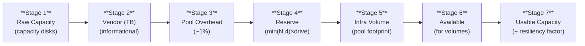

# Capacity Math — The 7-Stage Waterfall

S2DCartographer computes a 7-stage theoretical capacity waterfall showing how raw storage is accounted for from physical disks to final usable capacity.

---

## The 7 Stages



---

### Stage 1 — Raw Capacity

Sum of all **capacity-tier** disk sizes across all nodes. Cache-tier disks are excluded — they don't contribute to pool capacity.

!!! example "3-node, all-NVMe cluster"
    ```text
    4 nodes × 4× Samsung PM9A3 3.84 TB NVMe = 16 drives × 3.49 TiB = 55.88 TiB
    ```

---

### Stage 2 — After Vendor Labeling Adjustment

Shows the discrepancy between drive labels (TB) and what Windows reports (TiB). This is the unit-conversion gap described in [TiB vs TB](tib-vs-tb.md). No actual bytes are lost — this stage makes the difference visible.

!!! info "No bytes change at Stage 2"
    Stage 2 is informational. The `Size` value does not change from Stage 1. The stage description shows the vendor-labeled TB value so you can compare it to your drive specification sheets.

---

### Stage 3 — After Storage Pool Overhead

The pool consumes a small amount of space for metadata. Approximately 0.5–1% of raw capacity. The actual value comes directly from `StoragePool.TotalSize` via CIM.

---

### Stage 4 — After Reserve Space

Microsoft recommends keeping `min(NodeCount, 4)` capacity drive equivalents **unallocated** in the pool. This reserve allows the pool to rebuild after a drive failure without exhausting available space.

```text
Reserve = min(NodeCount, 4) × LargestCapacityDriveSize
```

!!! example "Reserve calculation"
    ```text
    4-node cluster, 3.84 TB drives (3.49 TiB each):
    Reserve = min(4, 4) × 3.49 TiB = 13.97 TiB
    ```

S2DCartographer reports the recommended reserve, the actual unallocated space, and one of three statuses:

| Status | Condition |
| --- | --- |
| `Adequate` | Free space ≥ recommended reserve |
| `Warning` | Free space is 50–100% of recommended |
| `Critical` | Free space < 50% of recommended |

!!! danger "Critical reserve"
    A Critical reserve means the cluster cannot sustain a drive failure and complete a full rebuild. Free pool space immediately.

---

### Stage 5 — After Infrastructure Volume

Azure Local automatically creates an infrastructure volume for cluster metadata, storage bus logs, and CSV metadata. This typically consumes 250–500 GiB depending on cluster size.

S2DCartographer detects the infrastructure volume by name pattern and size heuristic, and breaks it out separately so it does not inflate the workload capacity figure.

!!! note "Detection patterns"
    Volumes are classified as infrastructure if they match `Infrastructure_<guid>`, `ClusterPerformanceHistory`, `UserStorage_N`, `HCI_UserStorage_N`, `SBEAgent`, or contain `infra` in the name.

---

### Stage 6 — Available for Workload Volumes

What remains after reserve and infrastructure volume. This is the budget from which all user-created volumes draw their pool footprint.

---

### Stage 7 — Usable Capacity

Stage 6 (Available for Volumes) divided by the resiliency factor. This is the amount of logical data you can actually store.

| Resiliency type | Factor | Efficiency |
| --- | --- | --- |
| Three-way mirror | ÷ 3 | 33.3% |
| Two-way mirror | ÷ 2 | 50.0% |
| Nested two-way mirror (2-node) | ÷ 4 | 25.0% |
| Single parity (4-node) | varies | ~66.7% |
| Dual parity / LRC (6-node) | varies | ~66.7%+ |

`BlendedEfficiencyPercent` on the waterfall object reports the theoretical efficiency for the cluster's configured resiliency type.

!!! info "This is theoretical"
    The waterfall shows what you *can* store given perfect resiliency alignment. It is not a live count of what is provisioned. Actual provisioning state is in the Volume Map and Health Checks sections of the report.

---

## Example Waterfall

4-node cluster, 16× 3.84 TB NVMe (all capacity, all-NVMe):

| Stage | Name | Deducted | Remaining |
| --- | --- | --- | --- |
| 1 | Raw Capacity | — | 61.44 TB |
| 2 | Vendor (TB) | — | 61.44 TB (55.88 TiB) |
| 3 | Pool Overhead | −0.61 TB | 60.83 TB |
| 4 | Reserve | −15.36 TB | 45.47 TB |
| 5 | Infrastructure Volume | −0.08 TB | 45.39 TB |
| 6 | Available for Volumes | — | 45.39 TB |
| 7 | **Usable Capacity** | −30.26 TB | **15.13 TB** |

---

## Thin Overcommit Detection

Thin-provisioned volumes have a logical size greater than the current pool footprint. S2DCartographer flags clusters where the total logical size of all thin volumes exceeds the remaining available capacity — a dangerous condition that can cause unexpected out-of-space failures.

The `OvercommitRatio` from `Get-S2DStoragePoolInfo` and the `ThinOvercommit` health check in `Get-S2DHealthStatus` both surface this condition.

See [`Get-S2DCapacityWaterfall`](collectors/capacity-waterfall.md) for the full waterfall API reference.
