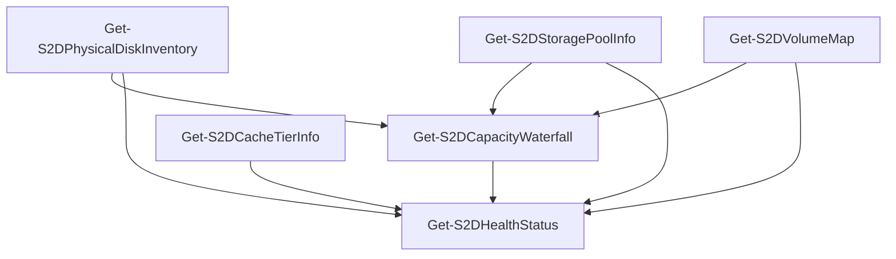

# Collectors

S2DCartographer collects data from your cluster using standard PowerShell storage and cluster cmdlets over CIM/WinRM. No agents are installed on cluster nodes. All collection is **read-only**.

Data is cached in the module session after first collection. Subsequent calls to `Get-S2DCapacityWaterfall` or `Get-S2DHealthStatus` reuse cached results automatically — no redundant queries.

---

## Available Collectors

| Collector | Returns | Description |
| --- | --- | --- |
| [`Get-S2DPhysicalDiskInventory`](collectors/physical-disks.md) | `PSCustomObject[]` | Per-node disk inventory with health, wear, and reliability counters |
| [`Get-S2DStoragePoolInfo`](collectors/storage-pool.md) | `S2DStoragePool` | Pool capacity, resiliency settings, overcommit ratio |
| [`Get-S2DVolumeMap`](collectors/volume-map.md) | `S2DVolume[]` | Volume resiliency, footprint, and infrastructure classification |
| [`Get-S2DCacheTierInfo`](collectors/cache-tier.md) | `S2DCacheTier` | Cache mode, all-flash detection, cache disk health |
| [`Get-S2DCapacityWaterfall`](collectors/capacity-waterfall.md) | `S2DCapacityWaterfall` | 8-stage capacity pipeline from raw to usable |
| [`Get-S2DHealthStatus`](collectors/health-checks.md) | `S2DHealthCheck[]` | 10 health checks with severity and remediation guidance |

---

## Collector Dependencies



Collectors 1–4 have no dependencies and can run in any order. `Get-S2DCapacityWaterfall` requires the first three. `Get-S2DHealthStatus` requires all five.

When called individually, each collector **auto-invokes its prerequisites** if their results are not already cached. This means calling `Get-S2DHealthStatus` alone will trigger all other collectors automatically.

---

## Session Cache

All collector results are stored in `$Script:S2DSession.CollectedData`:

```powershell
$Script:S2DSession.CollectedData = @{
    PhysicalDisks     = $null   # Get-S2DPhysicalDiskInventory
    StoragePool       = $null   # Get-S2DStoragePoolInfo
    Volumes           = $null   # Get-S2DVolumeMap
    CacheTier         = $null   # Get-S2DCacheTierInfo
    CapacityWaterfall = $null   # Get-S2DCapacityWaterfall
    HealthChecks      = $null   # Get-S2DHealthStatus
    OverallHealth     = $null   # set by Get-S2DHealthStatus
}
```

The cache persists for the lifetime of the module session. Call `Disconnect-S2DCluster` to clear all cached data and close sessions.

---

## Quick Reference

```powershell
Connect-S2DCluster -ClusterName "c01-prd-bal" -Credential (Get-Credential)

# Individual collectors
Get-S2DPhysicalDiskInventory | Format-Table NodeName, FriendlyName, Role, Size, WearPercentage
Get-S2DStoragePoolInfo       | Select-Object FriendlyName, TotalSize, RemainingSize, OvercommitRatio
Get-S2DVolumeMap             | Format-Table FriendlyName, ResiliencySettingName, Size, EfficiencyPercent
Get-S2DCacheTierInfo         | Select-Object CacheMode, IsAllFlash, CacheDiskCount, CacheState
Get-S2DCapacityWaterfall     | Select-Object -ExpandProperty Stages | Format-Table Stage, Name, Size, Delta
Get-S2DHealthStatus          | Format-Table CheckName, Severity, Status

Disconnect-S2DCluster
```
