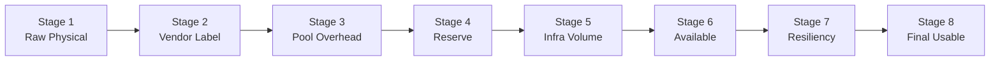

# Get-S2DCapacityWaterfall

Computes the complete 8-stage capacity accounting pipeline from raw physical disk capacity through resiliency overhead to final usable VM space.

---

## Syntax

```powershell
Get-S2DCapacityWaterfall
```

No parameters. All inputs are sourced from the module session cache — the function automatically runs prerequisite collectors if their data is not already cached.

---

## Prerequisites

`Get-S2DCapacityWaterfall` depends on data from three other collectors. It runs them automatically if needed:

1. `Get-S2DPhysicalDiskInventory` — capacity disk sizes, largest drive, node count
2. `Get-S2DStoragePoolInfo` — pool total size and free space
3. `Get-S2DVolumeMap` — volume footprints and infrastructure volume classification

To run collectors explicitly in advance:

```powershell
Connect-S2DCluster -ClusterName "c01-prd-bal" -Credential $cred
Get-S2DPhysicalDiskInventory | Out-Null
Get-S2DStoragePoolInfo       | Out-Null
Get-S2DVolumeMap             | Out-Null
$wf = Get-S2DCapacityWaterfall
```

---

## Output

Returns `S2DCapacityWaterfall` — a single object with top-level summary properties and a `Stages` array.

### Top-level properties

| Property | Type | Description |
| --- | --- | --- |
| `Stages` | `S2DWaterfallStage[]` | The 8 pipeline stages (see below) |
| `RawCapacity` | `S2DCapacity` | Stage 1 total (sum of capacity-tier disk bytes) |
| `UsableCapacity` | `S2DCapacity` | Stage 8 total (final VM-usable space) |
| `ReserveRecommended` | `S2DCapacity` | Recommended reserve: `min(NodeCount, 4) × LargestDrive` |
| `ReserveActual` | `S2DCapacity` | Actual free pool space |
| `ReserveStatus` | `string` | `Adequate`, `Warning`, or `Critical` |
| `IsOvercommitted` | `bool` | Whether `OvercommitRatio > 1.0` |
| `OvercommitRatio` | `double` | From `StoragePool.OvercommitRatio` |
| `NodeCount` | `int` | Node count used in reserve calculation |
| `BlendedEfficiencyPercent` | `double` | Average resiliency efficiency across workload volumes |

### Stage object properties

| Property | Type | Description |
| --- | --- | --- |
| `Stage` | `int` | Stage number (1–8) |
| `Name` | `string` | Stage label |
| `Size` | `S2DCapacity` | Remaining capacity at this stage |
| `Delta` | `S2DCapacity` | Bytes consumed vs previous stage (`$null` if none) |
| `Description` | `string` | Human-readable explanation of what changed |
| `Status` | `string` | `OK`, `Warning`, or `Critical` (Stage 4 reserve only) |

---

## The 8 Stages



| Stage | Name | What changes |
| --- | --- | --- |
| 1 | **Raw Physical** | Sum of all capacity-tier disk bytes (cache disks excluded) |
| 2 | **Vendor Label (TB)** | Display stage: shows vendor TB label vs Windows TiB. No bytes change. |
| 3 | **Pool (after overhead)** | Actual pool total size — captures ~0.5–1% metadata overhead |
| 4 | **After Reserve** | Subtracts `min(NodeCount, 4) × LargestCapacityDrive` |
| 5 | **After Infra Volume** | Subtracts Azure Local infrastructure volume footprint |
| 6 | **Available** | Pool space available for workload volumes |
| 7 | **After Resiliency** | Subtracts total workload volume pool footprints |
| 8 | **Final Usable** | Sum of workload volume logical sizes |

See [Capacity Math](../capacity-math.md) for a full explanation of each stage.

---

## Reserve Status

Stage 4 computes a reserve status based on how actual free pool space compares to the recommended reserve:

| Status | Condition |
| --- | --- |
| `Adequate` | `ReserveActual ≥ ReserveRecommended` |
| `Warning` | `ReserveActual ≥ 50% of ReserveRecommended` |
| `Critical` | `ReserveActual < 50% of ReserveRecommended` |

The reserve recommendation follows the Microsoft S2D guidance: keep `min(NodeCount, 4)` capacity drive equivalents unallocated so the pool can rebuild after a drive or node failure.

!!! danger "Critical reserve status"
    A Critical reserve means the pool cannot guarantee a complete rebuild after the loss of the largest drive. Immediately free pool space by shrinking or removing volumes.

---

## Session Behavior

Results are cached in `$Script:S2DSession.CollectedData['CapacityWaterfall']`. Calling `Get-S2DCapacityWaterfall` twice only queries the cluster once.

---

## Examples

```powershell
# Full waterfall pipeline
$wf = Get-S2DCapacityWaterfall
$wf.Stages | Format-Table Stage, Name, Size, Delta, Status

# Summary
"Raw:        $($wf.RawCapacity.Display)"
"Usable:     $($wf.UsableCapacity.Display)"
"Reserve:    $($wf.ReserveStatus) — Actual: $($wf.ReserveActual.Display), Recommended: $($wf.ReserveRecommended.Display)"
"Efficiency: $($wf.BlendedEfficiencyPercent)%"

# Check reserve
if ($wf.ReserveStatus -ne 'Adequate') {
    Write-Warning "Reserve is $($wf.ReserveStatus): actual $($wf.ReserveActual.Display) vs recommended $($wf.ReserveRecommended.Display)"
}

# Stage 4 only
$wf.Stages | Where-Object Stage -eq 4 | Format-List
```

---

## Troubleshooting

!!! warning "Stage 8 is 0 TiB"
    Final usable capacity is zero when no workload volumes exist. Either the cluster has no CSV volumes, or all volumes are classified as infrastructure. Check:

    ```powershell
    Get-S2DVolumeMap | Format-Table FriendlyName, IsInfrastructureVolume, Size
    ```

!!! note "Stage 2 shows no change"
    Stage 2 is informational only — it shows the vendor-labeled TB value alongside the Windows TiB value. The `Size` property does not change from Stage 1 to Stage 2 because the underlying bytes are the same. See [TiB vs TB](../tib-vs-tb.md) for an explanation of the discrepancy.

!!! tip "NodeCount affects reserve calculation"
    The reserve uses `min(NodeCount, 4)` where `NodeCount` comes from `$Script:S2DSession.Nodes.Count`. If you call `Get-S2DCapacityWaterfall` without an active `Connect-S2DCluster` session (e.g., passing `-CimSession` directly to collectors), the node count falls back to the disk symmetry group count or `4`. Use `Connect-S2DCluster` for accurate node counts.
