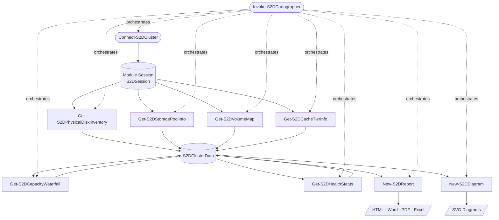

# Pipeline Architecture

S2DCartographer is built as a sequential pipeline with a shared session cache at its core. Understanding how the pieces fit together helps when using the module programmatically or troubleshooting unexpected results.

## Pipeline Overview



---

## Module Session (`S2DSession`)

`Connect-S2DCluster` creates a script-scoped hashtable (`$Script:S2DSession`) that all other commands read and write:

```powershell
$Script:S2DSession = @{
    ClusterName   = 'c01-prd-bal'
    ClusterFqdn   = 'c01-prd-bal.contoso.com'
    Nodes         = @('n01','n02','n03','n04')
    CimSession    = <CimSession>
    PSSession     = <PSSession>
    IsConnected   = $true
    IsLocal       = $false
    CollectedData = @{
        PhysicalDisks      = $null   # populated by Get-S2DPhysicalDiskInventory
        StoragePool        = $null   # populated by Get-S2DStoragePoolInfo
        Volumes            = $null   # populated by Get-S2DVolumeMap
        CacheTier          = $null   # populated by Get-S2DCacheTierInfo
        CapacityWaterfall  = $null   # populated by Get-S2DCapacityWaterfall
        HealthChecks       = $null   # populated by Get-S2DHealthStatus
        OverallHealth      = $null   # set by Get-S2DHealthStatus
    }
}
```

Every collector checks `CollectedData` before querying the cluster. If data is already present, it is returned from cache without a network round-trip. This means calling `Get-S2DCapacityWaterfall` twice only hits the cluster once.

---

## S2DClusterData Object

`Invoke-S2DCartographer -PassThru` and the individual collectors all build toward the same `S2DClusterData` object passed to report and diagram generators:

| Property | Type | Source |
| --- | --- | --- |
| `ClusterName` | `string` | Session |
| `NodeCount` | `int` | Session |
| `PhysicalDisks` | `S2DPhysicalDisk[]` | `Get-S2DPhysicalDiskInventory` |
| `StoragePool` | `S2DStoragePool` | `Get-S2DStoragePoolInfo` |
| `Volumes` | `S2DVolume[]` | `Get-S2DVolumeMap` |
| `CacheTier` | `S2DCacheTier` | `Get-S2DCacheTierInfo` |
| `CapacityWaterfall` | `S2DCapacityWaterfall` | `Get-S2DCapacityWaterfall` |
| `HealthChecks` | `S2DHealthCheck[]` | `Get-S2DHealthStatus` |
| `OverallHealth` | `string` | `Get-S2DHealthStatus` |
| `CollectedAt` | `datetime` | Orchestrator |

---

## Collector Call Order

`Invoke-S2DCartographer` calls collectors in dependency order:

1. `Get-S2DPhysicalDiskInventory` — no dependencies
2. `Get-S2DStoragePoolInfo` — no dependencies
3. `Get-S2DVolumeMap` — no dependencies
4. `Get-S2DCacheTierInfo` — no dependencies
5. `Get-S2DCapacityWaterfall` — depends on 1, 2, 3
6. `Get-S2DHealthStatus` — depends on 1, 2, 3, 4, 5

When called individually, each collector auto-invokes its prerequisites if their results are not already cached.

---

## CIM vs PS Sessions

S2DCartographer uses two session types in parallel:

| Session | Used For |
| --- | --- |
| `CimSession` | Storage queries (`Get-PhysicalDisk`, `Get-StoragePool`, `Get-VirtualDisk`, etc.) |
| `PSSession` | Node-level queries that require per-node execution (disk inventory loop, reliability counters) |

Both are established by `Connect-S2DCluster` and closed by `Disconnect-S2DCluster`. If you pass an existing `CimSession`, no `PSSession` is created — node-level queries fall back to per-node `Invoke-Command` using the CIM session's credentials.

---

## Using the Pipeline Manually

You do not need `Invoke-S2DCartographer` — all commands are composable:

```powershell
Connect-S2DCluster -ClusterName "c01-prd-bal" -Credential $cred

$disks  = Get-S2DPhysicalDiskInventory
$pool   = Get-S2DStoragePoolInfo
$vols   = Get-S2DVolumeMap
$wf     = Get-S2DCapacityWaterfall
$health = Get-S2DHealthStatus

# Build the data object manually
$data = [S2DClusterData]::new()
$data.ClusterName      = 'c01-prd-bal'
$data.PhysicalDisks    = $disks
$data.StoragePool      = $pool
$data.Volumes          = $vols
$data.CapacityWaterfall = $wf
$data.HealthChecks     = $health

New-S2DReport  -InputObject $data -Format Html -OutputDirectory "C:\Reports\"
New-S2DDiagram -InputObject $data -DiagramType All -OutputDirectory "C:\Reports\"

Disconnect-S2DCluster
```
