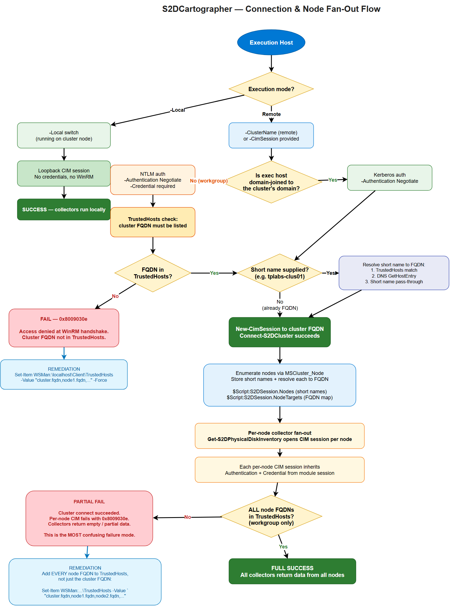

# Connecting to a Cluster

`Connect-S2DCluster` establishes the CIM and PowerShell sessions that every other collector and report command uses. All subsequent commands in the session reuse these sessions — you connect once and then call whatever collectors you need.

=== "Domain-Joined"

    The most common scenario. Your management machine is joined to the same domain (or a trusted domain) as the cluster nodes.

    ```powershell
    # Prompt for credentials
    Connect-S2DCluster -ClusterName "c01-prd-bal" -Credential (Get-Credential)

    # Or pass a pre-built credential object
    $cred = New-Object PSCredential("CONTOSO\ClusterAdmin", $securePass)
    Connect-S2DCluster -ClusterName "c01-prd-bal" -Credential $cred
    ```

    `ClusterName` accepts both short names (`c01-prd-bal`) and FQDNs (`c01-prd-bal.contoso.com`). When a short name is provided, S2DCartographer resolves the cluster IP via DNS and connects to the first available node.

    !!! tip "Use -Verbose for connection details"
        `Connect-S2DCluster -ClusterName "c01-prd-bal" -Credential $cred -Verbose` shows which node was contacted, the CIM session protocol negotiated, and the S2D pool name discovered.

=== "Non-Domain-Joined"

    Management machines outside the cluster's domain — common in lab environments, customer site visits, or cross-domain management.

    ```powershell
    # Explicit FQDN resolves DNS without Kerberos
    Connect-S2DCluster -ClusterName "c01-prd-bal.contoso.com" -Credential (Get-Credential)
    ```

    !!! warning "NTLM required for non-domain-joined machines"
        WinRM defaults to Kerberos for domain accounts. From a non-domain-joined machine you need NTLM or CredSSP. Ensure the target cluster nodes have NTLM enabled on their WinRM listener, or pre-configure a trusted hosts entry:

        ```powershell
        # Run once on your management machine (elevated)
        Set-Item WSMan:\localhost\Client\TrustedHosts -Value "*.contoso.com" -Force
        ```

    !!! note "Certificate-based WinRM"
        If the cluster uses HTTPS WinRM (port 5986), pass an existing `CimSessionOption` with `-CimSession`:
        ```powershell
        $opt = New-CimSessionOption -UseSsl
        $cim = New-CimSession -ComputerName "node01.contoso.com" -Credential $cred -SessionOption $opt
        Connect-S2DCluster -CimSession $cim
        ```

=== "Local Node"

    Run directly on a cluster node — no credentials needed, no network hops, no WinRM configuration required. Useful for automated scripts that run as scheduled tasks on a node.

    ```powershell
    Connect-S2DCluster -Local
    ```

    !!! info "What -Local does"
        Creates a loopback CIM session (no network) and sets `IsLocal = $true` in the module session. All collectors still execute the same code paths — only the session transport changes.

    !!! tip "Scheduled task pattern"
        ```powershell
        # Runs on a cluster node — no credential storage needed
        Import-Module S2DCartographer
        Connect-S2DCluster -Local
        Invoke-S2DCartographer -Format Html -OutputDirectory "\\fileserver\reports\"
        Disconnect-S2DCluster
        ```

=== "Key Vault (Unattended)"

    For automation pipelines and scheduled runs where storing credentials in scripts is not acceptable. Retrieves the cluster admin password from an Azure Key Vault secret.

    ```powershell
    # Requires: Az.KeyVault module + authenticated Az session (e.g., Managed Identity)
    Invoke-S2DCartographer -ClusterName "c01-prd-bal" `
        -KeyVaultName "kv-platform-prod" `
        -SecretName  "c01-prd-bal-admin-password" `
        -Format Html -OutputDirectory "C:\AutoReports\"
    ```

    !!! note "Secret format"
        The Key Vault secret value should be the **password only** as a plain string. The username defaults to `$ClusterName\Administrator`. To use a different username, retrieve the secret manually and build your own `PSCredential`:

        ```powershell
        $pw  = (Get-AzKeyVaultSecret -VaultName "kv-prod" -Name "cluster-pw").SecretValue
        $cred = New-Object PSCredential("CONTOSO\ClusterAdmin", $pw)
        Connect-S2DCluster -ClusterName "c01-prd-bal" -Credential $cred
        ```

    !!! tip "Azure Automation / Managed Identity"
        From an Azure Automation runbook or an Arc-enabled VM with a Managed Identity, call `Connect-AzAccount -Identity` before `Invoke-S2DCartographer`. The module will use the authenticated Az context to call Key Vault.

---

## Remoting Prerequisites

Before connecting from a management machine, verify the following:

### WinRM

S2DCartographer uses CIM over WinRM (HTTP port 5985 by default). The cluster nodes must have WinRM enabled and listening:

```powershell
# Run on each cluster node (or via GPO)
Enable-PSRemoting -Force
Set-Item WSMan:\localhost\Client\TrustedHosts -Value "*" -Force   # or specific management host IPs
```

### TrustedHosts (non-domain-joined management machines)

If your management machine is **not** domain-joined, Windows cannot use Kerberos to authenticate the remote host. You must add the cluster FQDN (or a wildcard) to your local TrustedHosts list:

```powershell
# Run once on your management machine (elevated)
Set-Item WSMan:\localhost\Client\TrustedHosts -Value "*.yourdomain.com" -Force

# Or add specific FQDNs
$current = (Get-Item WSMan:\localhost\Client\TrustedHosts).Value
Set-Item WSMan:\localhost\Client\TrustedHosts -Value "$current,tplabs-clus01.azrl.mgmt" -Force
```

!!! tip "Use FQDNs in TrustedHosts"
    S2DCartographer resolves short cluster names to FQDNs via DNS before connecting. If you configure TrustedHosts with short names (`tplabs-clus01`) but the module resolves to an FQDN (`tplabs-clus01.azrl.mgmt`), the WinRM handshake will fail with `0x8009030e`. Always use FQDNs in TrustedHosts.

    **Resolution order** used by `Connect-S2DCluster`:

    1. TrustedHosts — checks if the short name matches a FQDN entry and promotes it
    2. DNS (`GetHostEntry`) — resolves short name to FQDN
    3. Short-name pass-through — last resort
    4. Precise error with remediation steps if all fail

### Firewall

| Port | Protocol | Direction | Purpose |
| --- | --- | --- | --- |
| 5985 | TCP | Inbound on nodes | WinRM HTTP (default) |
| 5986 | TCP | Inbound on nodes | WinRM HTTPS (optional) |

---

## Connection & Node Fan-Out Flow

The full connection and per-node fan-out logic is visualized below. Use this diagram to understand **why a run can succeed at cluster connect and still fail during node-level collection** — the most confusing failure mode S2DCartographer produces.



[Open source `.drawio` file](assets/diagrams/connection-flow.drawio)

### Stage-by-stage explanation

1. **Execution host** — where you run `Invoke-S2DCartographer` or `Connect-S2DCluster`. Can be a cluster node (`-Local`), a domain-joined management server, or a workgroup / non-domain-joined laptop.
2. **Execution mode branch**:
    - `-Local` → loopback CIM session is created, no WinRM, no credentials needed. Collectors run immediately.
    - Remote → enters the authentication path.
3. **Domain-joined vs workgroup**:
    - Domain-joined → Kerberos via `-Authentication Negotiate`. No TrustedHosts required.
    - Workgroup → NTLM via `-Authentication Negotiate`. `-Credential` is required and the cluster FQDN must be in TrustedHosts.
4. **Short-name resolution** — if the caller passed a short name (`tplabs-clus01`), `Connect-S2DCluster` resolves it to an FQDN before connecting. Resolution order: TrustedHosts → DNS → short-name pass-through. If this fails you will see `0x8009030e` at `New-CimSession`.
5. **Cluster connect** — `New-CimSession` opens against the cluster FQDN. On success, `$Script:S2DSession.IsConnected = $true`.
6. **Node enumeration** — the module queries `MSCluster_Node` via the cluster session to get the list of member nodes. Short names are stored in `$Script:S2DSession.Nodes`; each is resolved to an FQDN and stored in `$Script:S2DSession.NodeTargets`.
7. **Per-node fan-out** — collectors like `Get-S2DPhysicalDiskInventory` open a **new CIM session per node** against the FQDN target. Each inherits `Authentication` + `Credential` from the module session.
8. **Node-level TrustedHosts check** — workgroup hosts need **every node FQDN** in TrustedHosts, not just the cluster FQDN. This is the most common cause of "cluster connects but collectors return empty" failures.

### Authentication inheritance

All per-node CIM sessions inherit the `Authentication` method and `Credential` from the module session established at connect time. You do not need to pass credentials again for per-node calls — the session state carries them automatically.

### Why short names vs FQDNs matter

WinRM negotiates authentication based on the target hostname. A short name that resolves via DNS to an FQDN will negotiate Kerberos; but if TrustedHosts is configured with FQDNs (the typical pattern on workgroup hosts), WinRM compares the **requested** hostname (short) against the trusted list (FQDN) and rejects the handshake. S2DCartographer resolves short names to FQDNs before issuing the CIM call specifically to avoid this mismatch.

!!! note "The module never silently modifies TrustedHosts"
    `Connect-S2DCluster` will **not** write to `WSMan:\localhost\Client\TrustedHosts` on your behalf. TrustedHosts is a security-sensitive setting and modifying it requires deliberate operator action. The module detects the misconfiguration and throws a precise error with remediation steps.

---

## Operator Decision Tree

Use this flow when setting up a new management host:

### Domain-joined management host (most common)

1. Join the host to the same AD forest as the cluster (or a forest with a trust).
2. Install RSAT: `Install-WindowsFeature RSAT-Clustering-PowerShell` (or equivalent on Windows 11).
3. Install the S2DCartographer module: `Install-Module S2DCartographer -Scope CurrentUser`.
4. Connect: `Connect-S2DCluster -ClusterName <cluster-fqdn> -Credential (Get-Credential)`.
5. No TrustedHosts configuration needed. Kerberos handles authentication end-to-end.

### Workgroup / non-domain-joined management host (lab, customer-site, laptop)

1. Install the S2DCartographer module: `Install-Module S2DCartographer -Scope CurrentUser`.
2. Configure TrustedHosts **with FQDNs for the cluster and every node** (elevated PowerShell):

        Set-Item WSMan:\localhost\Client\TrustedHosts `
            -Value "tplabs-clus01.azrl.mgmt,azl-n01.azrl.mgmt,azl-n02.azrl.mgmt,azl-n03.azrl.mgmt,azl-n04.azrl.mgmt" `
            -Force

        # Or use a wildcard if you trust the entire DNS zone
        Set-Item WSMan:\localhost\Client\TrustedHosts -Value "*.azrl.mgmt" -Force

3. Connect with explicit credentials — `Connect-S2DCluster -ClusterName <cluster-fqdn> -Credential (Get-Credential) -Authentication Negotiate`.

### Local execution on a cluster node (automation / scheduled tasks)

1. Install the module on the cluster node itself (or reference it from a share).
2. Run `Connect-S2DCluster -Local`. No credentials needed, no WinRM hops.
3. Ideal for scheduled tasks running as `SYSTEM` or a cluster service account.

### Cluster connect succeeds but collectors return empty / fail

This is **always** a per-node TrustedHosts or per-node firewall issue on workgroup hosts. The cluster FQDN is in TrustedHosts; the node FQDNs are not.

1. Verify every node FQDN is listed in TrustedHosts (see workgroup flow above).
2. Verify WinRM is open between your management host and every node (port 5985 by default).
3. Re-run `Invoke-S2DCartographer` — node-level CIM sessions will now succeed.

---

## Error Interpretation

| Error / Symptom | Root cause | Remediation |
| --- | --- | --- |
| `0x8009030e` at `New-CimSession` | Cluster FQDN is not in TrustedHosts (workgroup host). The WinRM SSPI handshake cannot negotiate auth against an untrusted host. | Add cluster FQDN to TrustedHosts (elevated PowerShell). |
| `The WS-Management service cannot process the request because it contains invalid selectors` | Short name resolved incorrectly, or target host's WinRM listener is bound to a different identity than the DNS name used. | Connect with explicit FQDN; verify `winrm enumerate winrm/config/listener` on the target. |
| Cluster connects, but `Get-S2DPhysicalDiskInventory` returns empty or throws on some nodes | Per-node FQDNs missing from TrustedHosts. Cluster-level CIM succeeded but the fan-out per-node sessions are failing silently. This is the **partial-success** failure mode. | Add every node FQDN to TrustedHosts, not just the cluster FQDN. |
| `Access is denied` (0x80070005) with domain credentials on a workgroup host | Credential format wrong — plain username instead of `DOMAIN\user` or `user@fqdn.domain` | Pass credentials with a qualified username; the `Get-Credential` dialog also accepts both formats. |
| `Connecting to remote server <short-name> failed ... The WinRM client cannot process the request.` | Short cluster name was passed and DNS resolution failed before the WinRM call. | Pass FQDN explicitly, or confirm the management host's DNS suffix search list includes the cluster's domain. |
| `Kerberos authentication was unable to obtain ticket` | Workgroup host attempting Kerberos (no KDC reachable). | Use `-Authentication Negotiate` (default) so NTLM fallback is allowed. |
| `Could not establish trust relationship for the SSL/TLS secure channel` | Using WinRM HTTPS (5986) against a cluster with a certificate not trusted by the management host. | Import the cluster's CA into the management host's Trusted Root store, or connect over HTTP (5985) if the lab allows. |

### Partial-success failure mode — why it happens

S2DCartographer's connect step uses a **single** CIM session to the cluster VIP/FQDN. The session enumerates nodes and caches short names. Collectors then create **new CIM sessions per node**. On a workgroup host, TrustedHosts must contain **all** FQDNs the module will hit — cluster FQDN AND every node FQDN. If only the cluster FQDN is listed:

- `Connect-S2DCluster` succeeds (cluster FQDN is trusted)
- Node enumeration succeeds (runs through the existing cluster session — no new CIM call)
- `Get-S2DPhysicalDiskInventory` fails (opens a new CIM session per node FQDN, which is NOT trusted)

The net effect is a confusing "connected but no data" state. Always add every node FQDN to TrustedHosts on workgroup hosts.

---

## Troubleshooting Recipes

### Recipe 1 — "I can't connect at all"

```powershell
# 1. Confirm you can reach WinRM on the cluster FQDN
Test-NetConnection -ComputerName tplabs-clus01.azrl.mgmt -Port 5985

# 2. Confirm DNS resolves the FQDN correctly
Resolve-DnsName tplabs-clus01.azrl.mgmt

# 3. Check TrustedHosts (workgroup hosts only)
Get-Item WSMan:\localhost\Client\TrustedHosts

# 4. Try raw CIM session first — isolates the module from the failure
New-CimSession -ComputerName tplabs-clus01.azrl.mgmt `
    -Credential (Get-Credential) -Authentication Negotiate
```

### Recipe 2 — "Cluster connects but collectors are empty"

```powershell
# 1. Get the list of node FQDNs the module resolved
Connect-S2DCluster -ClusterName tplabs-clus01.azrl.mgmt -Credential $cred
$Script:S2DSession.NodeTargets

# 2. Add every node FQDN to TrustedHosts
$current = (Get-Item WSMan:\localhost\Client\TrustedHosts).Value
$nodes   = ($Script:S2DSession.NodeTargets.Values -join ',')
Set-Item WSMan:\localhost\Client\TrustedHosts -Value "$current,$nodes" -Force

# 3. Retry
Invoke-S2DCartographer -ClusterName tplabs-clus01.azrl.mgmt -Credential $cred
```

### Recipe 3 — "I want to avoid TrustedHosts entirely"

Run from a cluster node with `-Local`:

```powershell
# On the cluster node itself
Import-Module S2DCartographer
Invoke-S2DCartographer -Local
```

Or run from a domain-joined jump host where Kerberos handles everything.

### Recipe 4 — "Credentials keep failing with 'Access denied'"

Cluster credentials **must** be in `DOMAIN\user` or `user@domain.fqdn` form. Plain `Administrator` or just `user` will not authenticate against a domain cluster from a non-domain-joined management host.

```powershell
# Wrong — will fail with 0x80070005
Connect-S2DCluster -ClusterName tplabs-clus01.azrl.mgmt `
    -Credential (New-Object PSCredential("Administrator", $pw))

# Correct
Connect-S2DCluster -ClusterName tplabs-clus01.azrl.mgmt `
    -Credential (New-Object PSCredential("AZRL\ClusterAdmin", $pw))
```

---

## Parameters

| Parameter | Type | Description |
| --- | --- | --- |
| `-ClusterName` | `string` | Cluster name or FQDN. Resolved via DNS. |
| `-Credential` | `PSCredential` | Username and password for authentication. |
| `-CimSession` | `CimSession` | Re-use an existing CIM session. |
| `-PSSession` | `PSSession` | Re-use an existing PS remoting session. |
| `-Local` | `switch` | Connect to the local machine (no credentials). |
| `-KeyVaultName` | `string` | Azure Key Vault name for unattended credential retrieval. |
| `-SecretName` | `string` | Key Vault secret containing the cluster admin password. |

---

## Disconnecting

Always disconnect when your session is complete to release CIM and PS sessions:

```powershell
Disconnect-S2DCluster
```

`Disconnect-S2DCluster` closes all open sessions and clears the module session cache. Calling it is safe even if no session is active.
